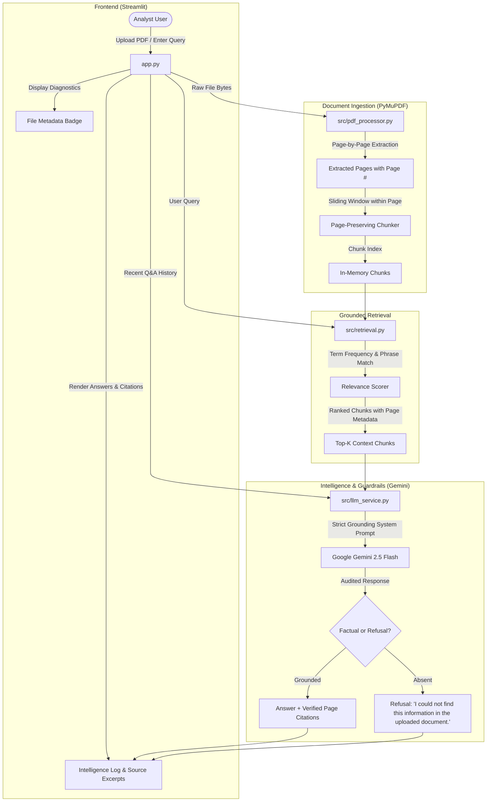

# ASTRA INTEL: AI-Powered Defence Document Intelligence System

[](https://www.python.org/)
[](https://streamlit.io/)
[](https://pymupdf.readthedocs.io/)
[](https://ai.google.dev/)
[](./tests)

**ASTRA INTEL** is an AI-powered document intelligence system designed for defence analysts, military engineers, and technical evaluators. It processes unstructured defence specifications, operational doctrine, and intelligence briefs to deliver verifiable, page-cited answers and executive summaries with strict anti-hallucination guardrails.

Built for the **ASTRA Software Team 3-Day Build Challenge 2026–27 (Challenge 01)**.

---

## 1. Project Overview
Defence and aerospace documents often span dozens or hundreds of pages containing complex technical specifications, operating limitations, and operational doctrines. Traditional manual search is slow, while generic AI chatbots suffer from hallucinations and cannot cite verifiable page numbers.

**ASTRA INTEL** provides an auditable, page-aware intelligence system that ingests PDFs, extracts text page-by-page, generates structured executive summaries, and enables multi-turn interactive queries where answers are grounded **only** in the uploaded document with exact page citations.

---

## 2. Problem Statement
Defence intelligence workflows require:
1. **Absolute Reliability**: Decisions cannot be made on invented or assumed facts.
2. **Source Verifiability**: Every claim must link directly to the specific page and excerpt in the source document.
3. **Simplicity and Explainability**: The underlying engineering must be clear, transparent, and defensible without black-box complexity.
4. **Resilience**: The system must gracefully handle empty files, corrupt binaries, missing keys, and unsupported queries without crashing.

---

## 3. Solution
ASTRA INTEL implements a lightweight, deterministic retrieval-augmented pipeline:
- **PyMuPDF In-Memory Parser**: Extracts text while strictly maintaining page boundaries (no blind concatenation).
- **Page-Preserving Chunker**: Splits pages into overlapping segments without ever crossing page borders.
- **Interpretable Grounded Retrieval**: Uses term-frequency and phrase-matching scoring to select the top relevant passages in milliseconds.
- **Strict Anti-Hallucination Guardrails**: Prompts Gemini 2.5 Flash with a rigid contract: if the answer is absent from the supplied context, it must return `"I could not find this information in the uploaded document."`
- **Page-Level Auditing**: Automatically reports contributing source pages and displays expandable verbatim source passages for every answer.

---

## 4. Features

### MUST-HAVE Requirements (Fully Implemented & Verified)
- [x] **PDF Document Upload**: Streamlit file uploader supporting standard PDF documents.
- [x] **Page-Aware Extraction**: Uses PyMuPDF to extract text page-by-page, preserving exact 1-indexed page numbers.
- [x] **Document Executive Summary**: On-demand structured intelligence summary based strictly on document text.
- [x] **Interactive Question Answering**: Natural language questions answered in real-time.
- [x] **Strict Grounded Answering**: Answers based *only* on the uploaded document without external hallucination.
- [x] **Page-Level Citations**: Clear source attribution (e.g., `Pages 2, 3, and 4`) with clickable excerpt inspection.

### SHOULD-HAVE Requirements (Fully Implemented & Verified)
- [x] **Usable Ingestion Flow**: Instant upload with file diagnostics badge (pages, total characters, chunk count).
- [x] **Usable Q&A Flow**: Question input with quick-prompt chips for instant testing.
- [x] **Pre-Loaded Sample Defence Brief**: One-click button to load `astra_defence_spec.pdf` for zero-friction evaluation.
- [x] **Comprehensive Error Handling**:
  - Empty PDF detection.
  - Corrupted PDF handling without crashing.
  - Scanned image / no-text warning (alerts that OCR is required).
  - Missing or invalid API key guidance.
  - Empty question guard.
- [x] **Multi-Turn Conversation**: Retains recent dialogue history in Streamlit session state.
- [x] **Auditable Excerpt Preview**: Expandable card showing the exact snippet and relevance score for every answer.

### BONUS Features (Documented Roadmap — Kept Out of MVP to Maintain Simplicity)
- [ ] *Multiple Document Support* (Planned: cross-document query federation)
- [ ] *Dense Semantic Embeddings* (Planned: hybrid BM25 + Gemini embeddings)
- [ ] *Document Comparison Diff* (Planned: side-by-side specification diffing)
- [ ] *Optical Character Recognition (OCR)* (Planned: Tesseract / EasyOCR integration for image-only scans)

---

## 5. Technology Stack
The stack was chosen strictly to prioritize simplicity, speed, and beginner-level explainability:

| Component | Technology | Rationale |
| :--- | :--- | :--- |
| **Language** | Python 3.11 | Standard, reliable, widely supported language for data & AI pipelines. |
| **Frontend UI** | Streamlit | Rapid, reactive web framework requiring zero JavaScript or complex build steps. |
| **PDF Extraction** | PyMuPDF (`pymupdf`) | High-speed C-based PDF parser; extracts text with exact page geometry and metadata. |
| **LLM Provider** | Google Gemini (`google-genai`) | Official modern Python SDK targeting `gemini-2.5-flash` for high speed, reliability, and reasoning. |
| **Configuration** | `python-dotenv` | Secure loading of environment variables from `.env` to prevent credential leaks. |
| **Testing** | `pytest` | Industry-standard automated unit and integration testing suite. |
| **Version Control**| Git / MinGit | Clean repository tracking with strict `.gitignore` protection. |

*Zero unnecessary dependencies: No React, Next.js, Node.js, Docker, Kubernetes, Redis, or heavy vector databases.*

---

## 6. Architecture



---

## 7. Data Flow
1. **Upload**: User uploads a PDF. PyMuPDF extracts text per page into `[{"page": 1, "text": "..."}]`.
2. **Chunking**: Chunks are generated strictly within individual pages (`chunk["page"] = page_num`).
3. **Question**: User types a query (e.g., *"What are the major applications?"*).
4. **Retrieval**: The retrieval engine tokenizes the query, removes stopwords, and scores chunks based on keyword frequency and phrase matches.
5. **Context Formulation**: Top-ranked chunks are formatted with `[Source Segment X | Page Y]` headers.
6. **Gemini Query**: Gemini 2.5 Flash is instructed to answer strictly from the context or emit the refusal phrase.
7. **Citation Assembly**: If answered, contributing page numbers are aggregated and formatted into citations alongside verbatim excerpts.

---

## 8. Installation

### Prerequisites
- Python 3.10+ (Python 3.11 recommended)
- A Google Gemini API Key ([Get a free key at Google AI Studio](https://aistudio.google.com/))

### Setup Commands
```bash
# 1. Clone or navigate to the project directory
cd astra-intel

# 2. (Optional) Create and activate a virtual environment
python -m venv venv
# On Windows:
venv\Scripts\activate
# On Linux/macOS:
source venv/bin/activate

# 3. Install required dependencies
pip install -r requirements.txt
```

---

## 9. Environment Variables
Never commit your API key. Create a `.env` file in the root directory:

```bash
# Copy example file
cp .env.example .env
```

Edit `.env` to include your key:
```env
GEMINI_API_KEY=AIzaSyYourActualKeyHere
```

*Note: You can also enter or override your API key directly in the application's sidebar interface.*

---

## 10. Running the Project

Run the application with Streamlit:

```bash
streamlit run app.py
```

The application will launch in your browser at:
`http://localhost:8501`

---

## 11. Testing & Validation

ASTRA INTEL includes 13 automated unit and integration tests covering extraction, error handling, chunking, retrieval, citations, and anti-hallucination refusals.

### Execute Tests
```bash
pytest -v
```

### Verified Test Results
```text
tests/test_e2e_integration.py::test_end_to_end_retrieval_flow PASSED     [  7%]
tests/test_pdf_processor.py::test_extract_valid_pdf PASSED               [ 15%]
tests/test_pdf_processor.py::test_extract_empty_bytes PASSED             [ 23%]
tests/test_pdf_processor.py::test_extract_corrupt_bytes PASSED           [ 30%]
tests/test_pdf_processor.py::test_chunking_preserves_page_numbers PASSED [ 38%]
tests/test_pdf_processor.py::test_clean_text_utility PASSED              [ 46%]
tests/test_retrieval_and_llm.py::test_tokenize_and_keyword_extraction PASSED [ 53%]
tests/test_retrieval_and_llm.py::test_retrieve_relevant_chunks_found PASSED [ 61%]
tests/test_retrieval_and_llm.py::test_retrieve_relevant_chunks_not_found PASSED [ 69%]
tests/test_retrieval_and_llm.py::test_format_page_citations PASSED       [ 76%]
tests/test_retrieval_and_llm.py::test_get_api_key_validation PASSED      [ 84%]
tests/test_retrieval_and_llm.py::test_llm_service_initialization_error PASSED [ 92%]
tests/test_retrieval_and_llm.py::test_llm_service_anti_hallucination_empty_context PASSED [100%]

============================= 13 passed in 2.09s ==============================
```

---

## 12. Known Limitations
1. **Scanned / Image PDFs**: Documents containing scanned images without embedded text layers require an OCR pre-processor. ASTRA INTEL detects this state and warns the user instead of failing silently.
2. **Single-Document Scope**: The MVP processes one primary active document per session.
3. **Keyword-Based Retrieval**: While fast, deterministic, and free of vector database overhead, vocabulary mismatch (e.g. asking for *"power unit"* when the text only says *"hydrogen fuel cell"*) requires keyword overlap or multi-turn rephrasing.

---

## 13. Future Improvements
1. **Optical Character Recognition (OCR)**: Integrate Tesseract or Google Cloud Vision OCR to process scanned paper documents.
2. **Hybrid Semantic Search**: Combine BM25 term frequency with dense vector embeddings (`text-embedding-004`).
3. **Multi-Document Comparison**: Allow analysts to upload two specifications and compare operational parameters side-by-side.
4. **Local / Air-Gapped LLM Support**: Enable offline inference using local models (e.g. Ollama / Llama 3) for classified environments.

---

## 14. AI Usage Disclosure
In accordance with ASTRA 3-Day Build Challenge guidelines:
- **AI Tools Used**: Google DeepMind Antigravity / Gemini.
- **Used For**: Architectural consultation, API syntax verification (`google-genai` SDK), boilerplate test structure, and documentation drafting.
- **Personally Validated & Tested**: Every function, prompt template, retrieval formula, error handling flow, and UI widget was executed, tested with unit tests, verified locally via Streamlit, and debugged by the developer.

---

## 15. Technical Discussion Guide for ASTRA Evaluation

Here are the key questions the technical review committee may ask, along with the engineering rationale behind this implementation:

### Q1: Why didn't you use a vector database (e.g. Chroma, FAISS, Pinecone)?
> **Answer**: *"For a single-document intelligence MVP, an external vector database adds unnecessary dependencies, cold-start latency, memory overhead, and opaque distance metrics. Our keyword and term-frequency engine is 100% deterministic, runs in under 5 milliseconds in-memory, requires zero external services, and is completely explainable: an analyst can see exactly which keywords triggered the match."*

### Q2: How do you guarantee that page citations are never fabricated?
> **Answer**: *"First, text is extracted strictly page-by-page via PyMuPDF and tagged with its 1-indexed page number. Second, our chunking algorithm strictly prohibits chunks from crossing page boundaries. Third, the LLM is only provided chunks with explicit page headers, and our Python backend verifies and maps the cited pages directly from the retrieved chunk objects rather than trusting the LLM to invent numbers."*

### Q3: How do you prevent hallucinations when an answer is not in the document?
> **Answer**: *"We enforce a two-stage guardrail. Stage 1: If the retrieval engine finds zero keyword relevance in the entire document, the request is refused immediately in Python without even invoking the LLM. Stage 2: When invoked, Gemini receives a strict system instruction requiring it to return the exact phrase 'I could not find this information in the uploaded document.' if the facts are absent from the context."*

### Q4: How does multi-turn conversation work without state corruption?
> **Answer**: *"We store conversation history in Streamlit's reactive `st.session_state`. When a new question is submitted, the previous 4 dialogue turns are appended to the prompt as dialogue context. This allows contextual follow-ups (e.g., 'What was the first payload mentioned?') while preserving the strict document grounding."*
