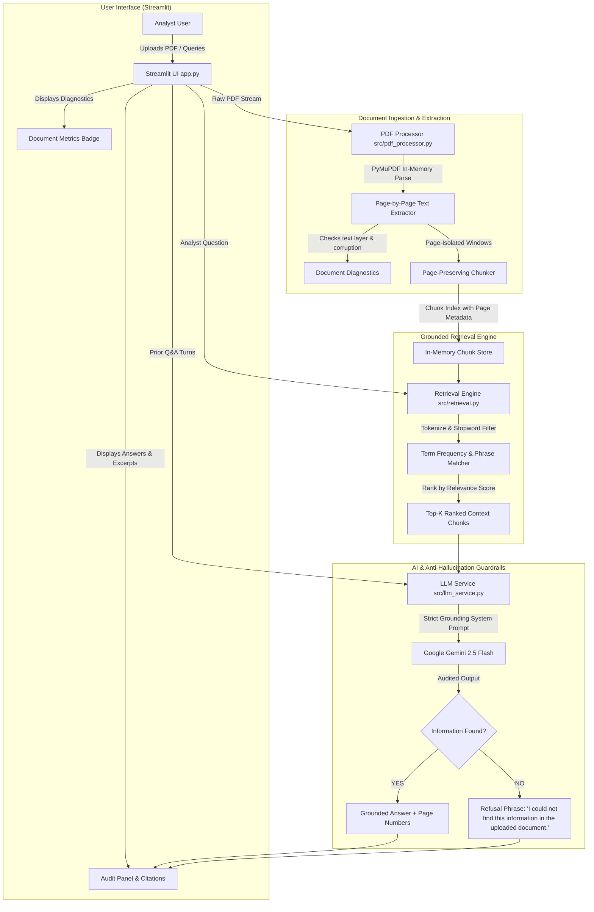
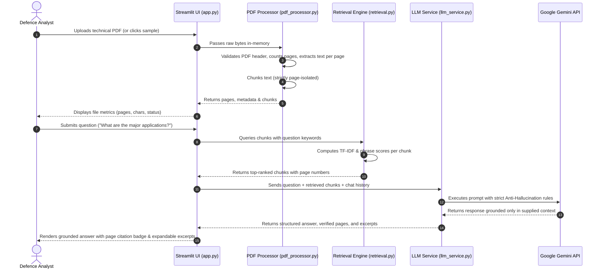

# ASTRA INTEL: System Architecture & Technical Design

## 1. Executive Summary
**ASTRA INTEL** is a defence document intelligence application built for the **ASTRA Software Team 3-Day Build Challenge 2026–27**. It provides defence analysts with an auditable, reliable, and grounded tool to parse technical documents, generate structured executive summaries, and ask complex domain questions with strict anti-hallucination guardrails and page-level source citations.

---

## 2. Architecture Diagram

The system architecture mirrors the real code implementation:

---

## 3. Data Flow Walkthrough

---

## 4. Component Deep-Dive

### 4.1 PDF Processing & Diagnostics (`src/pdf_processor.py`)
- **PyMuPDF (`fitz`) Integration**: Loads the PDF directly from in-memory bytes without writing temporary files to disk.
- **Strict Page Preservation**: Each extracted segment maintains an explicit `page` property (1-indexed).
- **Edge-Case Diagnostics**:
  - Detects 0-byte or corrupted files and raises user-friendly `PDFProcessingError` exceptions.
  - Computes `has_readable_text` by calculating character density. If a PDF is a scanned image with no embedded text, it alerts the user that OCR would be required.
- **Page-Isolated Sliding Window Chunking**:
  - Chunks long pages into overlapping segments (default: 800 characters with 150-character overlap) to prevent cutting sentences in half.
  - **CRITICAL DESIGN RULE**: Chunks **never** span multiple pages. A chunk belongs to one, and only one, page. This guarantees that page citations are 100% mathematically and factually accurate.

### 4.2 Transparent Grounded Retrieval (`src/retrieval.py`)
- **Deterministic Keyword Retrieval**: Instead of introducing heavyweight vector databases (e.g., ChromaDB, Pinecone, FAISS) which are opaque and difficult for beginners to inspect and debug, ASTRA INTEL implements an interpretable term-frequency scoring engine.
- **Scoring Pipeline**:
  1. *Tokenization*: Strips punctuation and lowercases text.
  2. *Stopword Filtering*: Removes 120+ standard non-informative English words (`the`, `is`, `at`, `which`).
  3. *Term Frequency Scaling*: Rewards chunks containing multiple instances of query keywords with logarithmic scaling.
  4. *Keyword Coverage Multiplier*: Exponentially rewards chunks containing *multiple distinct* query keywords.
  5. *Exact Phrase Bonus*: Adds a +5.0 bonus if the user's verbatim phrase appears in the chunk.
  6. *Soft Length Normalization*: Divides by \(\sqrt{\text{length} + 10}\) to avoid bias toward giant passages.
- **No-Match Detection**: If no keywords match, the retrieval engine signals `has_relevant_content = False`, preventing the LLM from hallucinating an answer.

### 4.3 LLM Service & Anti-Hallucination Guardrails (`src/llm_service.py`)
- **Google GenAI SDK**: Integrates the modern `google-genai` library targeting `gemini-2.5-flash`.
- **Strict Grounding Contract**:
  - Context is formatted with explicit page markers: `[Source Segment {i} | Page {p}]`.
  - Prompt enforces a non-negotiable instruction:
    > "Use ONLY the supplied document context. Do not use outside knowledge. If the answer cannot be found or directly inferred from the supplied document context, you MUST respond EXACTLY: 'I could not find this information in the uploaded document.'"
- **Citation Extraction**: When an answer is grounded, the page numbers from the contributing chunks are returned and formatted into human-readable citations (e.g., `Pages 2, 3, and 4`).
- **Multi-Turn Chat History**: Maintains prior conversational turns so follow-up inquiries (e.g., *"Which one was mentioned first?"*) work seamlessly.

### 4.4 User Interface (`app.py`)
- Built in **Streamlit**.
- Styled with a clean, dark military-grade intelligence theme (`#0e1117`).
- Includes one-click **"Load Sample Defence Brief"** for friction-free evaluation.
- Includes quick-prompt chips for instant testing, including an adversarial refusal test (*"What is the nuclear warhead payload capacity?"*).
